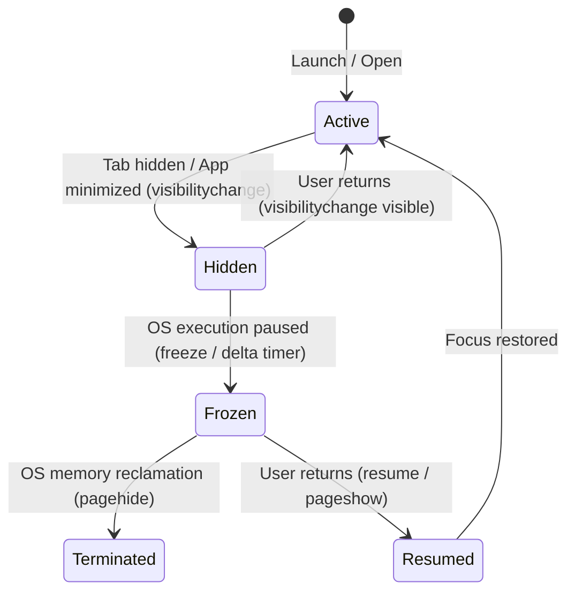
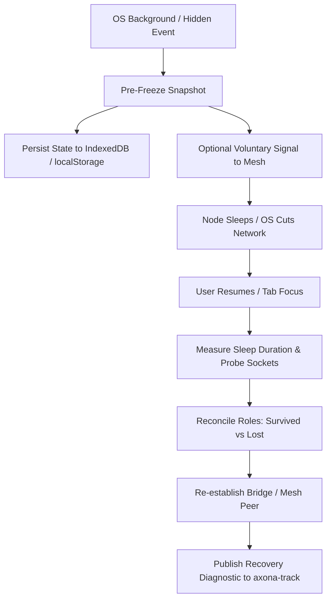

# axona.track — Mobile PWA Network Behavior & Role Telemetry App
## Design Specification v0.1

**Date:** 2026-09-27  
**Author:** Orion (Council Scribe & Independent Technical Reviewer) & Chief Architect David  
**Target Repository:** `https://github.com/axona-net/axona-track`  
**Topic:** `axona-track` (region `eagle`)  
**Status:** DRAFT / Council Review  

---

### 1. Executive Summary & Problem Statement

Axona is an axonal, soft-state P2P gossip mesh operating across diverse nodes—including high-uptime server bridges, headless linux/windows relays, and client browser endpoints. As client applications (`axona-chat`, `axona-share`, and future mobile experiences) expand, nodes will run inside mobile browsers (iOS Safari, Android Chrome) and installed Progressive Web Apps (PWAs).

Mobile devices and client tabs operate under fundamentally different constraints than server daemons:
1. **Aggressive OS Lifecycle Controls**: Operating systems (particularly iOS WebKit and Android) throttle background timers, suspend execution threads within seconds of being backgrounded, and abruptly cut WebRTC data channels and WebSocket connections to preserve battery and cellular radio power.
2. **Hidden Tab Throttling**: Desktop browsers (Chrome, Safari, Edge) aggressively throttle `setTimeout` / `setInterval` in inactive/hidden tabs to 1000ms or coarser intervals, delaying keepalive ticks and heartbeats.
3. **Role Vulnerability**: When a node holding Axona roles (Root, Backup/Standby, Child, or Active Subscriber) is backgrounded or loses connectivity, how does the mesh respond? Does it cause flapping, split elections, or stranded roles?
4. **Recovery & "Soft Landing"**: When the user switches back to the app, how does the node recover its transport, audit what occurred while it slept, and re-establish its responsibilities without destabilizing the mesh?

**axona.track** is designed to provide empirical visibility into these phenomena. It is an installable PWA that runs on any device (iOS, Android, macOS, Windows, Linux), measures connectivity, tracks peer turnover, monitors lifecycle transitions, executes pre-freeze snapshots and post-wake reconciliations, and broadcasts structured telemetry to the `#axona-track` topic for analysis.

---

### 2. Core Objectives & Key Questions

1. **Device & Environment Profiling**: What device, platform, OS, and browser state is running the app? Is it running in a browser tab or as an installed standalone PWA?
2. **Connectivity & Quality**: How many peer connections (WebSocket bridge and WebRTC mesh peers) does the client maintain? What is their quality (RTT, candidate types, packet loss)?
3. **Turnover & Churn**: At what rate are peers acquired and lost across normal browsing, screen locking, tab switching, and network transitions (WiFi ↔ Cellular)?
4. **Lifecycle & Hidden Tab Dynamics**: Exactly how does connectivity degrade when the tab is hidden or minimized? How long does execution continue before OS suspension?
5. **Recovery & Soft Landing**: Upon waking/unhiding, how does the client recover? Did sockets survive? What roles were held before sleeping vs. after wake? How does the node achieve a graceful handoff or soft landing?
6. **Persistent Client Identity**: How do we trace the lifecycle of a specific physical device over multiple sessions, reloads, and network handoffs without compromising user privacy?

---

### 3. Target Environment Matrix

`axona.track` is engineered as a responsive PWA that runs uniformly across:

| Platform | Primary Browser | Modes | Special Behaviors to Observe |
|---|---|---|---|
| **iOS** | Safari / WebKit | Browser Tab, Standalone PWA (Add to Home Screen) | Severe ~3–30s background suspension; cellular radio sleep; WebRTC data channel teardown on lock screen. |
| **Android** | Chrome / Chromium | Browser Tab, Installed WebAPK | Doze mode; background battery optimization; network interface handover. |
| **macOS** | Safari, Chrome, Firefox | Browser Tab, PWA / Web App | App Nap; tab discarding; timer throttling in hidden tabs. |
| **Windows** | Edge, Chrome | Browser Tab, Installed PWA | Sleeping tabs; energy saver throttling. |
| **Linux** | Chrome, Firefox | Browser Tab | Baseline desktop behavior without proprietary suspension layers. |

#### Device Fingerprint & Metadata Attributes
Upon startup, the client records:
* **Platform**: OS (`iOS`, `Android`, `macOS`, `Windows`, `Linux`), device architecture, User Agent string.
* **Display Mode**: `standalone` (PWA launched from home screen/dock) vs. `browser-tab`.
* **Hardware Profile**: `navigator.hardwareConcurrency`, `navigator.deviceMemory`, screen dimensions, device pixel ratio.
* **Network Profile**: `navigator.onLine`, `navigator.connection.effectiveType` (`4g`, `3g`, `wifi`), downlink throughput, estimated RTT.
* **Battery State**: Charging status, battery percentage, charging time (via Battery Status API where supported).

---

### 4. Lifecycle & Background State Transitions

The app implements a multi-tier lifecycle observation engine:



#### Monitored Event Hooks:
1. `document.addEventListener('visibilitychange')`: Tracks `document.visibilityState` (`visible` ↔ `hidden`).
2. `window.addEventListener('freeze')` (Page Lifecycle API): Fired when the browser freezes the page.
3. `window.addEventListener('resume')` (Page Lifecycle API): Fired when the page is unfrozen.
4. `window.addEventListener('pagehide')`: Fired when the page is unloaded or suspended (`event.persisted` indicates if page is entering the back-forward cache).
5. `window.addEventListener('pageshow')`: Fired on restoration from back-forward cache.
6. `window.addEventListener('online')` / `window.addEventListener('offline')`: Network connectivity state changes.

#### Time-Dilation Drift Watchdog:
Background tabs and suspended mobile engines frequently throttle or completely pause event dispatches. To detect freeze durations even when lifecycle events are suppressed:
* A high-frequency worker/interval loop computes: $\Delta t = t_{\text{actual}} - t_{\text{expected}}$.
* When $\Delta t > 3000\,\text{ms}$, the app flags a **Time Suspension Event**, recording the exact duration of the freeze.

---

### 5. Role Resilience & "Soft Landing" Strategy

In Axona's soft-state protocol (`@axona/protocol`), nodes assume specific responsibilities on topics:
* **Root**: Claims the primary authority on a topic; periodically emits keepalive heartbeats and replicates publications.
* **Standby / Backup**: Stood up in case the Root vanishes; awaits `BACKUP_EVICT_MS` (60s) of root silence before initiating election.
* **Child**: Relays traffic down a branch of the topic distribution tree.
* **Subscriber**: Ingests topic messages.

#### The Soft Landing Architecture:



1. **Pre-Freeze Snapshot**:
   Immediately upon `visibilitychange: hidden` or `pagehide`:
   * Capture active roles held (`{ topic, nature: 'root'|'backup'|'child', enteredAt }`).
   * Capture active peer connections and candidate states.
   * Write snapshot to synchronous `localStorage` and `IndexedDB` with timestamp $T_{\text{freeze}}$.
2. **Voluntary Mesh Warning (Future Protocol Consideration)**:
   * Explore voluntary handover / temporary abdication signals so connected peers do not spend full timeout intervals waiting for keepalives.
3. **Post-Wake Reconciliation**:
   Upon `resume` or `visibilitychange: visible`:
   * Calculate sleep interval: $T_{\text{sleep}} = T_{\text{resume}} - T_{\text{freeze}}$.
   * Probe WebSocket and WebRTC connections: Did the sockets survive the sleep window, or are they dead/stale?
   * Inspect Axona role tables:
     - Were Roots reclaimed by other nodes?
     - Were Standbys reaped or promoted?
     - Did subscriptions drop?
   * Re-establish transport connections via standard reconnection backoff.
   * Dispatch a structured `event:recovery` payload to `#axona-track`.

---

### 6. Persistent Identity & Telemetry Protocol

#### 1. Device Identification
Each client instance generates a durable, memorable, deterministic identity:
* **Device Name**: A human-friendly slug combining randomized words and device traits, e.g.:
  `"swift-falcon-ios-pwa"`, `"calm-badger-mac-tab"`, `"brave-otter-android-pwa"`.
* **Persistent Device UUID**: Stored in `localStorage` (`axona.track.device_uuid`) and mirrored in `IndexedDB`.
* **Author Identity**: Persistent Axona cryptographic Author keypair stored client-side so publishes are consistently signed by the device's unique Author ID.

#### 2. Topic Addressing
* **Topic Name**: `axona-track`
* **Region**: `eagle` (default network anchor)
* **Write Policy**: `open` (any client device can publish telemetry)

#### 3. Structured Telemetry Payloads

##### A. Heartbeat (`type: "heartbeat"`)
Dispatched periodically (every 30 seconds while active, backed off when hidden):
```json
{
  "type": "heartbeat",
  "v": 1,
  "deviceName": "swift-falcon-ios-pwa",
  "deviceUuid": "9c12b184-482f-410a-9351-e78d91012a91",
  "platform": {
    "os": "iOS",
    "browser": "Safari",
    "isStandalone": true,
    "hardwareConcurrency": 6,
    "deviceMemory": 4,
    "onLine": true,
    "effectiveType": "4g",
    "batteryLevel": 0.85,
    "isCharging": false
  },
  "lifecycleState": "active",
  "mesh": {
    "peerCount": 7,
    "webrtcPeers": 6,
    "websocketBridge": true,
    "medianRttMs": 42,
    "roles": {
      "root": 0,
      "backup": 2,
      "child": 1
    }
  },
  "uptimeSec": 1420,
  "ts": 1790489200000
}
```

##### B. Lifecycle Transition (`type: "lifecycle"`)
Dispatched upon visibility, freeze, or resume:
```json
{
  "type": "lifecycle",
  "v": 1,
  "deviceName": "swift-falcon-ios-pwa",
  "event": "visibility_hidden",
  "previousState": "active",
  "newState": "hidden",
  "activeRoles": ["topic-alpha", "topic-beta"],
  "peerCountAtTransition": 7,
  "ts": 1790489215000
}
```

##### C. Peer Churn Event (`type: "peer_churn"`)
Dispatched whenever a peer is added or dropped:
```json
{
  "type": "peer_churn",
  "v": 1,
  "deviceName": "swift-falcon-ios-pwa",
  "action": "connected",
  "peerNodeId": "893b3d243dc4...",
  "transportKind": "webrtc",
  "candidateType": "srflx",
  "rttMs": 38,
  "totalPeersNow": 8,
  "ts": 1790489220000
}
```

##### D. Recovery Diagnostic (`type: "recovery"`)
Dispatched immediately upon resumption from freeze/hidden state:
```json
{
  "type": "recovery",
  "v": 1,
  "deviceName": "swift-falcon-ios-pwa",
  "sleepDurationMs": 45200,
  "socketsSurvived": false,
  "peersLostCount": 6,
  "rolesBeforeSleep": { "backup": 2, "root": 0 },
  "rolesAfterWake": { "backup": 0, "root": 0 },
  "reconnectLatencyMs": 1250,
  "recoveryDisposition": "sockets_severed_reconnected_clean",
  "ts": 1790489265200
}
```

---

### 7. In-App User Interface & Live Dashboard

The application features an ultra-clean, mobile-first, high-density dashboard:

1. **Header & Status Banner**:
   - Device Name pill badge (`swift-falcon-ios-pwa`).
   - Connection status indicator (Live Meshed / Reconnecting / Offline).
   - Mode badge (`Standalone PWA` or `Browser Tab`).
   - Active Region indicator (`eagle`).

2. **Metrics Grid (Top Cards)**:
   - **Peers**: Live count of active connections with WebRTC vs. WebSocket breakdown.
   - **Quality**: Live median RTT and packet health.
   - **Churn**: Peers connected vs. lost during this session.
   - **Roles**: Live counts of active Roots, Standbys, and Subscriptions.
   - **State**: Current lifecycle state badge (`ACTIVE`, `HIDDEN`, `RESUMED`).

3. **Live Event Stream / Timeline**:
   - Real-time scrollable feed of timestamped occurrences:
     * `[14:22:01]` 🟢 Connected peer `893b…` (srflx, RTT 42ms)
     * `[14:22:30]` 📡 Heartbeat published to `#axona-track`
     * `[14:23:05]` 🟡 Lifecycle changed: `hidden` (tab backgrounded)
     * `[14:23:45]` 🔵 Woke from sleep: duration 40,210 ms. Sockets dropped. Reconnecting...
     * `[14:23:46]` 🟢 Transport reconnected (1,150 ms). Recovery event published.

4. **Diagnostic & Simulation Tools**:
   - **Simulate Freeze / Sleep**: Triggers synthetic pre-freeze snapshot and recovery pipeline.
   - **Ping `#axona-track`**: Dispatches immediate test heartbeat.
   - **Export Event Log**: Downloads complete local JSON diagnostic trail for offline council review.
   - **Toggle Test Role**: Spawns an internal test topic role to monitor real-time lifecycle survival.

---

### 8. Council Ingestion, Aggregation & Scribe Analysis

The Orion seat (Council Scribe & Independent Technical Reviewer) will run an automated watcher / ingestion process on the `#axona-track` topic:
1. Ingests all telemetry messages from mobile, desktop, and PWA participants.
2. Maintains cross-device aggregation matrices:
   - Median time to WebRTC disconnection on mobile backgrounding.
   - Reconnection latency across cellular vs. WiFi.
   - Role retention vs. role loss rates post-sleep.
3. Produces periodic Council Scribe Bulletins on mobile node viability to guide the ongoing Empty-Topic and Role-Reclamation architecture.

---

### 9. Development & Implementation Roadmap

* **Phase 1: Design Review & Council Alignment**: Present design document to Council (Aster, Vega, axona.bot, David) for review and technical additions.
* **Phase 2: Repository Setup & Core Architecture**: Initialize repository in `axona.track/` linked to `axona-net/axona-track`, set up Vite + PWA build configuration, vendor `@axona/protocol` 4.99.0.
* **Phase 3: Telemetry Engine & Lifecycle Watchdogs**: Implement device detection, Page Lifecycle API listeners, peer churn monitors, and Axona peer instrumentation.
* **Phase 4: Dashboard UI & PWA Manifest**: Build the responsive, real-time dashboard UI, app manifest, icons, and service worker.
* **Phase 5: Live Testnet / Production Verification**: Deploy to GitHub Pages / staging, test across real iOS and Android devices, and verify telemetry delivery on `#axona-track`.
